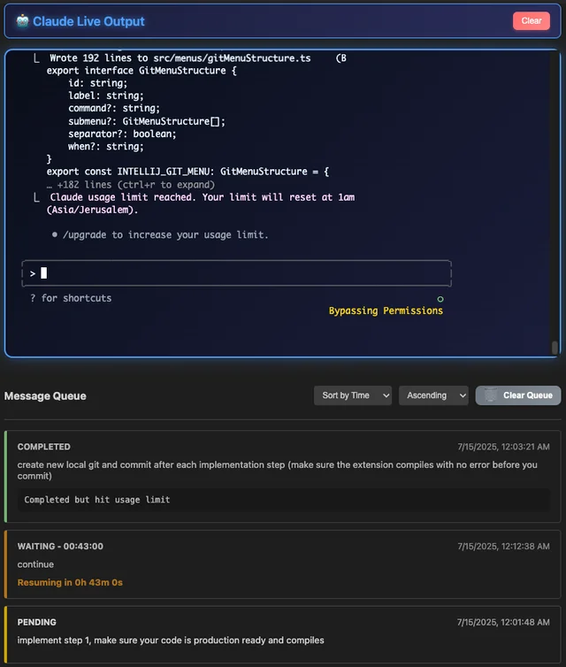

# Claude Autopilot - Automated Claude Code Task Management

[](https://marketplace.visualstudio.com/items?itemName=benbasha.claude-autopilot)
[](https://github.com/benbasha/Claude-Autopilot/releases/tag/v0.1.6)
[](LICENSE)

**Claude Autopilot** lets you run Claude Code while you sleep, eat, or play with your kids. Set up your tasks, hit start, and come back to completed work. This powerful VS Code extension provides fully automated Claude Code task management with intelligent queue processing and auto-resume functionality.

<div align="center">
  
</div>

> 💤 **"Queue up 100 tasks Friday evening, wake up Monday with everything done"**

## ✨ Features

### 🚀 **24/7 Automated Processing**

-   **Set It and Forget It**: Queue hundreds of tasks and let Claude Autopilot work autonomously
-   **Auto-Resume**: Automatically resume processing when Claude usage limits reset - no manual intervention needed
-   **Sleep Prevention**: Keeps your computer awake during processing so work continues overnight
-   **Smart Queue Management**: Process multiple Claude Code tasks automatically with intelligent queueing
-   **Batch Processing**: Handle large workloads efficiently - perfect for weekend or overnight runs

### 🔧 **Robust Process Management**

-   **Dependency Checking**: Automatic detection and validation of Claude Code and Python dependencies
-   **Cross-Platform Support**: Works seamlessly on Windows, macOS, and Linux
-   **IDE Compatibility**: Full support for VS Code and Cursor
-   **Error Recovery**: Comprehensive error handling with automatic retry mechanisms
-   **Health Monitoring**: Continuous monitoring of Claude Code process health

### ⚙️ **Advanced Configuration**

-   **Extensive Settings**: Fine-tune every aspect of Claude Autopilot behavior
-   **Configuration Validation**: Built-in validation with helpful error messages
-   **Development Mode**: Special features and debugging tools for developers
-   **Sleep Prevention**: Keep your computer awake during long processing sessions

### 📊 **Rich User Interface**

-   **Interactive Webview**: Intuitive interface for managing queues and monitoring progress
-   **Mobile Web Interface**: Complete web-based interface for remote access and control
-   **Real-time Updates**: Live status updates and progress tracking via WebSocket
-   **History Browser**: Browse and filter previous processing runs
-   **Command Palette**: Quick access to all Claude Autopilot commands
-   **QR Code Access**: Easy mobile access via QR code scanning

## 🚀 Quick Start

### Prerequisites

1. **Claude Code**: Install Claude Code from [https://www.anthropic.com/claude-code](https://www.anthropic.com/claude-code)
2. **Python 3.8+**: Required for process management
3. **VS Code 1.74.0+** or **Cursor**: Compatible with VS Code and Cursor

### Installation

1. Install from [VS Code Marketplace](https://marketplace.visualstudio.com/items?itemName=benbasha.claude-autopilot)
2. Or install via command palette: `Extensions: Install Extensions` → Search "Claude Autopilot"
3. Or install from VSIX: `code --install-extension claude-autopilot-0.1.6.vsix`
4. **Cursor**: Claude Autopilot works seamlessly in Cursor with the same installation process

### Basic Usage

1. **Start Claude Autopilot**: Open Command Palette (`Cmd/Ctrl+Shift+P`) → `Claude: Start Claude Autopilot`
2. **Add Messages**: Queue up all your tasks - add 10, 50, or 200+ messages
3. **Start Processing**: Click "Start Processing" and walk away
4. **Live Your Life**: Go eat dinner, play with kids, sleep, or enjoy your weekend
5. **Return to Completed Work**: Claude Autopilot handles everything automatically, even through Claude usage limits

## 📋 Commands

| Command                          | Description                                      |
| -------------------------------- | ------------------------------------------------ |
| `Claude: Start Claude Autopilot` | Start the Claude Autopilot interface and session |
| `Claude: Stop Claude Autopilot`  | Stop Claude Autopilot and close the session      |
| `Claude: Add Message to Queue`   | Add a new message to the processing queue        |
| `Claude: Start Web Interface`    | Start the web interface for mobile access       |
| `Claude: Stop Web Interface`     | Stop the web interface server                   |
| `Claude: Show Web Interface QR Code` | Display QR code for easy mobile access      |

## ⚙️ Configuration

Claude Autopilot offers extensive configuration options. Access settings via `File → Preferences → Settings → Extensions → Claude Autopilot`.

### Queue Management

```json
{
    "claudeAutopilot.queue.autoMaintenance": true
}
```

### Session Management

```json
{
    "claudeAutopilot.session.autoStart": false,
    "claudeAutopilot.session.skipPermissions": true,
    "claudeAutopilot.session.healthCheckInterval": 30000
}
```

### Sleep Prevention

```json
{
    "claudeAutopilot.sleepPrevention.enabled": true,
    "claudeAutopilot.sleepPrevention.method": "auto"
}
```

### History & Logging

```json
{
    "claudeAutopilot.history.maxRuns": 20,
    "claudeAutopilot.history.autoSave": true,
    "claudeAutopilot.history.showInUI": false
}
```

### Web Interface

```json
{
    "claudeAutopilot.webInterface.useExternalServer": false,
    "claudeAutopilot.webInterface.password": ""
}
```

## 🏗️ Architecture

Claude Autopilot follows a modular architecture with clear separation of concerns:

```
src/
├── core/           # Core state, types, and configuration
├── claude/         # Claude CLI integration and communication
├── queue/          # Queue management and processing
├── services/       # External services (health, sleep, dependencies)
├── ui/             # User interface and webview management
└── utils/          # Shared utilities and logging
```

### Key Components

-   **Queue Manager**: Handles message queueing, processing, and operations
-   **Claude Integration**: Manages Claude Code process and communication
-   **Dependency Checker**: Validates and manages required dependencies
-   **Configuration System**: Comprehensive settings with validation

## 🔒 Security & Privacy

-   **Local Processing**: All processing happens locally on your machine
-   **No Data Collection**: Claude Autopilot doesn't collect or transmit personal data
-   **Secure Dependencies**: Validates Claude Code and Python installations
-   **Permission Awareness**: Uses `--dangerously-skip-permissions` only in trusted environments

## 🛠️ Development

### Building from Source

```bash
# Clone the repository
git clone https://github.com/benbasha/Claude-Autopilot.git
cd Claude Autopilot

# Install dependencies
npm install

# Compile TypeScript
npm run compile

# Start watch mode for development
npm run watch

# Package for distribution
vsce package
```

### Development Mode

Enable development mode for additional debugging features:

```json
{
    "claudeAutopilot.developmentMode": true
}
```

This enables:

-   Debug logging and diagnostics
-   Configuration validation tools
-   Advanced queue operations

## 🎯 Use Cases

### Perfect for:

-   **Weekend Warriors**: Queue up your entire week's refactoring Friday evening
-   **Large Refactoring Projects**: Process hundreds of files while you sleep
-   **Batch Code Generation**: Generate components, tests, and documentation overnight
-   **Migration Tasks**: Convert frameworks or update dependencies during family time
-   **Quality Assurance**: Run comprehensive code reviews while you're at dinner
-   **Documentation Generation**: Create docs for your entire codebase while you relax

### Real-World Examples:

-   Converting a React class component codebase to functional components
-   Adding TypeScript types to a large JavaScript project
-   Generating API documentation from code comments
-   Migrating from one testing framework to another
-   Adding accessibility features across a web application

## 📚 Wiki & Documentation

### Core Concepts

**Queue Processing**: Claude Autopilot maintains a persistent queue of messages that can be processed automatically. Each message represents a task or instruction for Claude Code.

**Auto-Resume**: When Claude Code hits usage limits, Claude Autopilot automatically detects this and schedules the queue to resume when limits reset.

**Workspace Integration**: Each VS Code workspace maintains its own queue and history, allowing you to manage multiple projects independently.

**Dependency Management**: Claude Autopilot automatically checks for and validates all required dependencies (Claude Code, Python) before starting.

### Advanced Features

**Batch Operations**: Process multiple related tasks in sequence with consistent context and state management.

**Queue Management**: Full CRUD operations on queue items - add, edit, remove, duplicate, and reorder messages as needed.

**History Tracking**: Complete history of all processing runs with filtering and search capabilities.

**Cross-Platform**: Native support for Windows, macOS, and Linux with platform-specific optimizations.

## 🤝 Contributing

Contributions are welcome! Please read our [Contributing Guide](CONTRIBUTING.md) for details on:

-   Code style and conventions
-   Testing requirements
-   Pull request process
-   Issue reporting
-   Development environment setup

## 📄 License

This project is licensed under the MIT License - see the [LICENSE](LICENSE) file for details.

## 🐛 Known Issues & Troubleshooting

### Common Issues

**Claude Code Not Found**

-   Ensure Claude Code is installed and in your PATH
-   Restart VS Code after installing Claude Code
-   Check dependency status in Claude Autopilot panel

**Python Not Found**

-   Install Python 3.8 or later
-   Ensure Python is in your PATH
-   On Windows, check "Add Python to PATH" during installation

**Permission Errors**

-   Claude Autopilot uses `--dangerously-skip-permissions` for automation
-   Only use in trusted development environments
-   Disable if working with sensitive data

### Getting Help

-   🐛 [Bug Reports](https://github.com/benbasha/Claude-Autopilot/issues/new?template=bug_report.md)
-   💡 [Feature Requests](https://github.com/benbasha/Claude-Autopilot/issues/new?template=feature_request.md)
-   💬 [Discussions](https://github.com/benbasha/Claude-Autopilot/discussions)
-   📖 [Wiki Documentation](https://github.com/benbasha/Claude-Autopilot/wiki)

### Support

If you find Claude Autopilot helpful, consider:

-   ⭐ Starring the repository
-   🐛 Reporting bugs or suggesting features
-   🤝 Contributing code or documentation
-   💬 Helping others in discussions

---

**Made with ❤️ for the Claude Code community**

_Claude Autopilot is not affiliated with Anthropic or Claude AI. Claude Code is a product of Anthropic._
